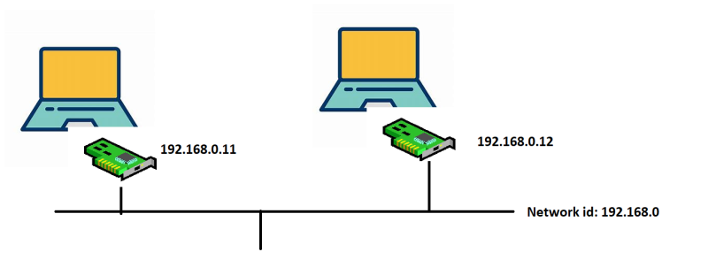

# Networking

- Lets try to understand home network with internet access
  

### IP Adress

- `unique number to identify a device on the network`
- Ip Adress has combination of `Ip Addres => Network id + Host/Device id`
- `Ip Adress wil provide the Network Interfaces`
- To know ip execute ipconfig
   
- When we executed ipconfig we got
  - ipaddress
  - subnet mask
  - default gateway
- IpV4 address: Ip Address is a 32 bit number. broken down into 4 octects (8 bit)
- Range is 0.0.0.0 to 255.255.255.255
- `Subnet mask also helps in identifying size of network`
  
### Network Interface

- `Network Interfaces connect to the network (Wired or Wireless) and gets an IP Address`
- whenever your data send out of the system the packet will be created these are called Network packet. every network packet will have source(source means your who it has send i.e laptop) and destination(destination means where it has to reach i.e browser) 
-   

- Two devices can communicate directly if they are in same network. The way to figure out if they belong to same network is if they have same network id. which network is larger
  

- Example:      1   2   3   4
            ip: 192.168.0.11
            sm: 255.255.255.0
    
  - octects with 255 => 1,2,3 => 192.168.0 (Network id) => fixed part
  - network id: 192.168.0
  - octects with 0 => 4(octects/positions)
      host id: 11 => variable part
  - octect means 8(bits)=> 2power8 => 256 ip adresses have generated => 2power n-1 => 2 power 8 _1 => 0.0.0.0 to 255.255.255.255
  - they keep first four and last one(which cloud provide)
  
Example:2

                1   2   3   4
            ip: 192.168.0.12
            sm: 255.255.0.0

  - octects with 255 => 1,2,3 => 192.168.0 (Network id) => fixed part
  - network id: 192.168
  - octects with 0 => 4(octects/positions)
      host id: 0.12 => variable part
  - octect means 8(bits)=> 2power16 =>65536 
 

### Router:

`Router is networking component which has rules (Route table) which can forward packets from one network to other`
- network packet jumping(travele) from one network to other is called hoping
- expample: tracert <Browser Name>
- Router is shown as default gateway in ipconfig

### DNS(Domain Name System)

Network packets dont understand names.
Network interfaces tries to resolve the name by its ip address and generally this information (name to ip) is present in DNS servers
exampe: ping <Browser Name>
